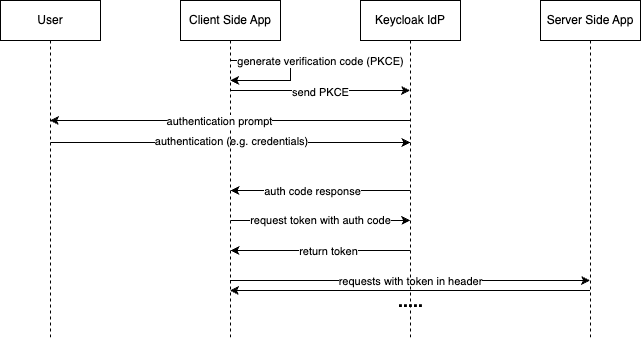
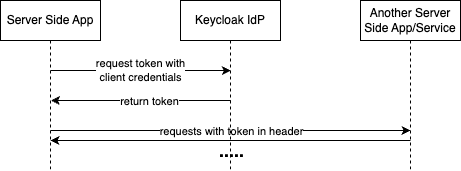
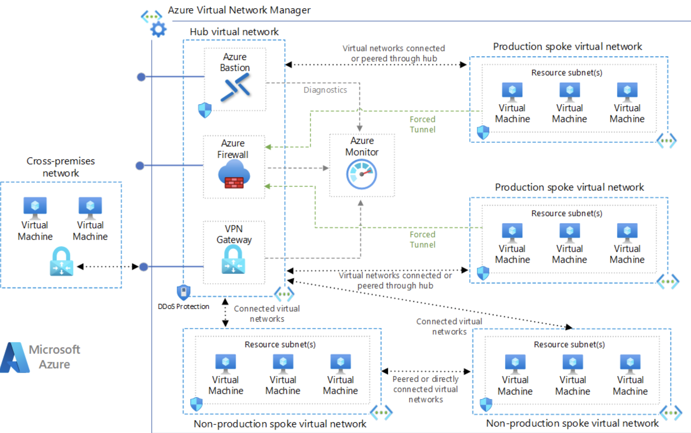

# WP02

## 1. Architecture Description

### Overview

The proposed architecture is designed to provide secure, reliable, and cloud-agnostic authentication mechanisms for GitHub Enterprise services across a hybrid cloud environment consisting of public cloud, e.g. Microsoft Azure, and a private cloud. The central component of this architecture is Keycloak, an open-source Identity and Access Management (IAM) solution provided by the central IT. The architecture ensures seamless integration, high availability, and compliance with security standards.

### Rough Overview of Components

1. **Keycloak Identity Provider (IDP):** As given as a requirement to use Keycloak we propose a deployment in a high-availability configuration across both public and the private cloud to ensure redundancy and low-latency access for users in different environments.
2. **GitHub Enterprise Server:**
    - Deployed on a virtual machine (VM) in the public and cloud
    - The VM should fulfill following requirements ([source](https://docs.github.com/en/enterprise-server@3.10/admin/installing-your-enterprise-server/setting-up-a-github-enterprise-server-instance/installing-github-enterprise-server-on-azure))
        - 20 vCPUs
        - 160GB RAM
        - 200GB Root Storage
        - 1TB Attached Storage
    - Integration with Keycloak for authentication and authorization
    - The underlaying infrastructure is managed with terraform and is deployed using CI/CD pipelines.
3. **CI/CD Pipeline:** Integration of GitHub Enterprise into the CI/CD tools (e.g. Jenkins) across the hybrid environment.
4. **Rsyslog:** To ensure centralized and fast log processing, a cental Rsyslog server is used. Rsyslog receives log entries from applications and services so they can be monitored, analyzed and archived using the monitoring and logging tools described below.
5. **Grafana + Loki/Promtail + Prometheus** as Monitoring & Logging Tool
    - Prometheus collects **fine-grained metrics** from each service
    - Loki collects **metric data related to logs**
    - Grafana allows **flexible visualization and custom alerting**
    - **Easily** **scale** monitoring as new sources are added through Rsyslog or directly
6. **Splunk** as Security Information and Event Management (SIEM)
    - Integration for real-time security monitoring

### Authentication Mechanisms

### Identity Provider Options in a Hybrid Environment

- **Federated Keycloak Deployment:** Keycloak instances are deployed in both the public and the private cloud, configured in a cluster with bidirectional synchronization to ensure consistency.
- **High Availability Setup:** It is recommended to distribute auth traffic between different keycloak instances. Thus a load balancer should be used. All keycloak instances still access the same or a replicated data storages. This makes the setup more reliable, scalable and available.

#### Fallback Solutions for IDP Outage

- **Redundant Keycloak Instances:** Deployment of multiple Keycloak instances with load balancing to prevent single points of failure as described in the High Availability Setup section above.
- **Failover Mechanism:** Automated failover to a backup IDP instance in case the primary IDP fails.
- **Offline Access Tokens:** Configuring offline tokens with appropriate security controls to allow service continuity. ([source](https://wjw465150.gitbooks.io/keycloak-documentation/content/server_admin/topics/sessions/offline.html))

### Authentication Protocols

- **OpenID Connect (OIDC):** Selected for its modern approach, compatibility with OAuth 2.0, and support in Keycloak and GitHub Enterprise.
  - *Justification:* OIDC is lightweight, JSON-based, and widely adopted for modern web applications. It allows for better integration with RESTful services and mobile applications.
- **SAML 2.0:** Also supported to ensure compatibility with any legacy systems or services requiring SAML.
  - *Justification:* SAML is a mature protocol suitable for enterprise SSO scenarios, ensuring backward compatibility.

### GitHub Integration

### Integration with CI/CD Pipeline

- **Webhooks and API Integration:** GitHub Enterprise communicates with CI/CD tools via webhooks and APIs secured through Keycloak authentication. We assume that Jenkins is currently in use and included it into the overall architecture.
- **Infrastructure as Code (IaC):** Use of tools like Terraform and Ansible to manage infrastructure and configurations, with repositories hosted on GitHub Enterprise.

### Authentication and Authorization for Repositories

- **Role-Based Access Control (RBAC):** Defined roles and permissions within GitHub Enterprise managed via Keycloak groups and roles. ([source](https://www.keycloak.org/docs/latest/authorization_services/index.html))
- **Single Sign-On (SSO):** As for other applications, also for GitHub, Users authenticate once via Keycloak and gain access to all authorized repositories and services.
- **Github structure:** The Github Enterprise is split into Organizations, Teams, Projects and Repos, each having only the users and groups as members. Here again, the assignments of the roles and memberships follows the least privilege principle.
- **Fine-Grained Personal Access Tokens (PATs):** Tokens issued by Github Enterprise for Github access with scoped permissions to use where other authentication methods are not suitable.

### Peripheral Aspects

### Monitoring & Logging

- **Audit Logs:** Keycloak's audit logs capture authentication events, which are forwarded to the centralized logging system.
- **Monitoring Tools:** Prometheus and Grafana monitor system health, authentication metrics, and performance indicators.
- **Anomaly Detection:** Implementing anomaly detection to identify unusual access patterns or potential security threats in Splunk and trigger alerts.

### Splunk Integration

- **Log Forwarding:** All authentication and access logs are forwarded to the SIEM system in real-time.
- **Correlation Rules:** SIEM analyzes logs to correlate events, detect security incidents, and generate alerts.
- **Dashboard and Reporting:** Custom dashboards provide insights into authentication activities, compliance status, and security posture.

### Security Framework Compliance

### Security Standards & Frameworks

ISO/IEC 27001 is ideal for the location Germany due to its **GDPR** alignment, international recognition, and structured approach to managing security across people, processes, and technology. It is also recognized world wide and one of the most commonly needed and used standard for information systems. However the ISO is more a standard and a certification for processes than a framework.

Additionally, NIST CSF 2.0 complements ISO/IEC 27001 by providing a flexible framework that addresses emerging cyber threats and technologies. This combination ensures a comprehensive approach to cybersecurity that is both internationally recognized and adaptable to evolving risks. By implementing both frameworks, the organization can achieve a robust security posture that meets global standards while remaining agile in the face of new challenges.

### Ensuring Compliance

- **Policies and Procedures:** Implementing NIST security policies aligned with the ISO27001 controls.
- **Regular Assessments:** Conducting periodic security assessments and audits.
- **Training and Awareness:** Providing security training to users and administrators.
- **Data Protection Measures:** Encrypting data in transit and at rest, implementing strong access controls.
- **Secret and Keys Storage:** Secrets, passwords, keys and any sensible information are saved in encrypted KeyVaults. The access to the values are restricted to the as smallest group as possible (least privilege approach). All access to the values are logged and reported to Spunk.
- **Static Code Analysis:** Enforce enterprise wide static code analysis before publishing code by tools like Sonarqube in the pipeline

### Authentication Flows

There are different ways to authenticate a user or a service based on OpenID Connect (OIDC). In this section, the two main options, known as authentication flows, are described.

- **AuthCode with PKCE:**

    Is used whenever a real user (not a service) wants to access an application. The authentication process is handled by Keycloak, which provides a Single Sign-On (SSO) page. The client application requests this page and uses Proof Key for Code Exchange (PKCE) for added security. Keycloak presents the authentication page and prompts the user to enter their credentials, such as username (email) and password. It is recommended to also configure multi-factor authentication (MFA) in the authentication flow. If MFA is enabled, Keycloak will prompt the user for the additional authentication step before returning the PKCE to the application. Once the user is successfully authenticated, the client application receives an authentication code.

    With this code, a token (optionally and recommended a refresh token) can be requested from the identity provider Keycloak. The token is a signed string with user information and additional information such as rights, roles, and more. The token is sent (commonly in the HTTP header) to the server-side application with the requests (e.g., Get Repo Details). The server-side application checks the token's validity and if the user is authorized to perform the action.

    If the token is a refresh token, the client application must request a new token every x seconds from the IdP, because of its limited validity.

    We recommend the use of this auth flow to authenticate users to access any service. For example, when an admin wants to access the Grafana Dashboard, the authentication must be done over the SSO Keycloak page. After a successful authentication, the user is forwarded to the dashboard.

    

- **Client Credentials:**

    ### Client Credentials Flow

    The Client Credentials Flow is an OAuth 2.0 grant type that allows a client (such as a backend service or microservice) to directly obtain an access token by authenticating itself to the authorization server, without requiring user involvement. It is primarily used for machine-to-machine (M2M) interactions, such as when a backend system needs to access APIs or services.

    In this flow, the client sends its credentials (client ID and secret) to the authorization server, which issues an access token if the client is authenticated successfully. The client requests specific access scopes and receives an access token, which it uses to call protected resources. The resource server then validates the token before granting access.

    Unlike other OIDC flows that involve end-user authentication and consent, the Client Credentials Flow is entirely focused on the client itself, making it ideal for trusted services that need to authenticate and authorize themselves for secure API access.

    We propose to use this authentication flow for the communication and authentication between the services. For example, writing logs to Prometheus/Loki, or GitHub Enterprise calling webhooks of the Jenkins CI/CD tool.

    

## 2. Architecture Diagram

The architecture diagram provides a simplified overview of the hybrid cloud infrastructure. The network follows a hub-and-spoke topology, as illustrated in the Microsoft diagram below.

At the core is the **hub virtual network**, which serves as the central point for all other networks, connected either via peering or routing. The hub is hosted in the cloud and manages all external connections. For instance, when a service like GitHub Enterprise Server is accessed from the public internet, the request is routed through the hub and directed to the appropriate service in a spoke network.

The hub's primary function is to manage incoming and outgoing traffic. To accomplish this, three key resources are utilized within the hub:

- **Firewall**: Filters all traffic between the public internet and internal services.
- **VPN Gateway**: Connects private cloud networks to the hub, allowing client devices to access resources via secure VPN connections.
- **App Gateway/Load Balancer**: Manages incoming traffic, distributing it across services and instances within the network.

All other networks, referred to as **spokes**, function as local networks with their only external connection to the hub network.

Above is a clockwise overview of the spoke networks, starting from the top-right section of the diagram. The **log spoke network** resides in a private cloud and hosts all services related to log and security logging. While it is recommended to ensure redundancy by hosting logs in the cloud, we have simplified this setup by deploying it solely in the private cloud due to time constraints.

Next are the two virtual networks for the **Keycloak identity provider**. One is deployed in the private cloud, while the other operates in the public cloud. For simplicity, both networks have identical Keycloak configurations, with the key difference being that the private cloud network contains a VPN gateway for connection to the public cloud hub.

In both environments, Keycloak is configured for high availability with multiple stateless instances running on scalable nodes, which adjust based on demand. Each instance accesses a shared SQL database that is redundantly synchronized, highly available, and regularly backed up (not shown for simplicity). The two Keycloak setups are bidirectionally synced via identity federation, ensuring consistent availability across both clouds.

Clients can securely connect to the VPN gateway, granting controlled access to the network resources.

The **GitHub Enterprise Server (GHES) instances** are deployed similarly to the Keycloak networks. To ensure availability, at least one virtual machine runs GHES in each network. The configuration of these VMs is detailed in the section above. Both GHES instances are interconnected, with CI/CD pipelines triggered via webhooks to the Jenkins Pipeline Tool.

This network topology offers scalable and robust infrastructure, adhering to platform best practices. In real-world scenarios, each project is provided with a pre-configured landing zone, which includes the necessary components for creating a spoke virtual network. Teams can work independently within their landing zone spokes, while any changes to the hub network (such as whitelisting IP addresses or managing incoming traffic) are handled by the platform team. This centralized network management enhances the platform's security, further reinforced by policies that restrict external connections exclusively to the hub network.

([source](https://learn.microsoft.com/de-de/azure/architecture/networking/architecture/hub-spoke?tabs=cli))

## 3. Reliability Analysis

### Potential Points of Failure

- **IDP Outage:** Failure of Keycloak could prevent user authentication.
- **Network Connectivity Issues:** Network problems could disrupt communication between components.
- **Service Overload:** High traffic might overwhelm servers.
- **Private Cloud Outage**: The private cloud can suffer an outage and all services depending on the private cloud would not be available. Especially for critical services such as Splunk it must be ensured that is always available or replicated in the public cloud.

### Mitigation Strategies

### Redundancy and High Availability

- **Keycloak Clustering:** Multiple Keycloak instances with session replication.
- **Geographical Distribution:** Deploy instances in different data centers to mitigate localized failures.
- **Load Balancing:** Use of load balancers to distribute traffic and detect failed instances.
- **Private Public Cloud Replication**:  We propose implementing a hybrid cloud strategy with failover capabilities. This approach involves replicating critical services and data across both the public and private cloud, ensuring continuity of operations even if one environment experiences an outage.

### Failover Mechanisms

- **Automated Failover:** Scripts or services that automatically switch to backup systems upon failure detection.
- **Health Checks:** Regular health monitoring of services to detect and respond to issues promptly.

### Disaster Recovery

- **Data Backups:** Regular backups of configurations and data.
- **Recovery Plans:** Documented procedures for restoring services.

### Capacity Planning

- **Scalability:** Design systems to scale horizontally to handle increased load.
- **Performance Monitoring:** Continuous monitoring to anticipate and address bottlenecks.

## 4. Justifications

### Authentication Mechanisms and Protocols

- **Keycloak as IDP:** Provides a unified, open-source solution compatible with required protocols.
- **OIDC Selection:** Besides above mentioned justification, it is modern, REST-friendly, and suitable for microservices architecture.
- **Fallback/Failover Solutions:** Ensuring no single point of failure enhances reliability and user trust.

### Monitoring and Security Framework

- **Monitoring Tools:** Prometheus and Grafana provide comprehensive visibility into system health and performance, enabling proactive issue detection and resolution. These tools offer real-time insights, customizable dashboards, and alerting capabilities, ensuring optimal system operation and rapid response to potential problems. Splunk integration provides advanced log management and analysis capabilities, enabling deeper insights into security events and user activities. Its powerful search and correlation features enhance threat detection and incident response, complementing the real-time monitoring provided by Prometheus and Grafana.
- **ISO/IEC 27001 + NIST CSF 2.0 Selection:** The ISO standards are internationally recognized and accepted. Thus, a certification does not only proofs the security of the systems, but also builds trust for partners and suppliers.  In addition NIST CSF 2.0 provides a robust framework adaptable to hybrid cloud environments and compatible with the ISO/IEC 27001 standards. it is developed by the US government and has the focus on cybersecurity. Besides that, it is customizable and flexible. In the US it is widely used in healthcare, finance and energy.

## 5. Architecture decision records

Based on ([Decision record template by Michael Nygard](https://github.com/joelparkerhenderson/architecture-decision-record))

### 1. Choosing rsyslog as the centralized logging system

#### Status

Accepted

#### Context

As part of our efforts to improve the reliability and efficiency of our logging infrastructure, we need a centralized logging system that can handle high volumes of log data, provide robust features for log management, and ensure compatibility with our tools and services.

#### Decision

We have decided to adopt rsyslog as our centralized logging system. This choice is based on its ability to handle high log volumes efficiently, its compatibility with various log formats and protocols, and its support for advanced features such as log rotation, filtering, and forwarding.

#### Consequences

Adopting rsyslog as our centralized logging system will streamline log management by aggregating logs from multiple sources into a single, manageable location. This consolidation will simplify the process of analyzing and troubleshooting issues, making it easier to detect and address problems more effectively. The scalability of rsyslog ensures it can handle high volumes of log data, adapting as our needs grow, and its integration with existing tools and systems will facilitate a smooth transition.

### 2. Adopting Grafana + Loki/Promtail + Prometheus for Monitoring & Logging

#### Status

Accepted

#### Context

We are setting up a new monitoring and logging infrastructure to enhance our ability to monitor system performance and troubleshoot issues effectively. We need a solution that integrates well, supports both metrics and logs, and scales with our growing needs. The planned infrastructure aims to provide a unified, scalable approach to real-time monitoring and log management.

#### Decision

We are implementing Grafana in combination with Loki/Promtail and Prometheus for our monitoring and logging needs. Grafana will be utilized for its advanced visualization capabilities, Loki with Promtail will handle log aggregation and indexing, and Prometheus will manage metrics collection and alerting. This integrated solution is chosen to offer a comprehensive and scalable monitoring and logging framework.

#### Consequences

The new setup of Grafana, Loki/Promtail, and Prometheus will significantly improve our monitoring and logging capabilities. Grafana will enable advanced data visualization, Loki and Promtail will streamline log management, and Prometheus will provide robust metrics collection and alerting.

### 3. Choosing Splunk as SIEM service

#### Status

Accepted

#### Context

The need for a robust SIEM tool that integrates well with our infrastructure components and meets our performance and scalability requirements is crucial.

#### Decision

We have decided to choose Splunk as our SIEM tool for the infrastructure. Splunk was selected due to its comprehensive feature set that aligns with our needs, including real-time monitoring, advanced threat detection, and extensive integration options. Its scalability and performance, coupled with a strong ecosystem of apps and add-ons, make it a suitable choice for handling our security and operational data. In addition to this, it offers a good ecosystem and integration due to a big community.

#### Consequences

Implementing Splunk will involve licensing and operational costs, which need to be accounted for in the budget.

### 4. Adoption of OIDC as Primary Authentication Protocol in Keycloak

Choice of primary authentication protocol

#### Status

Accepted

#### Context

Our primary goals for this authentication solution are to ensure seamless integration with modern applications and services, support for single sign-on (SSO) to enhance user experience, and compatibility with a variety of identity providers and platforms. Additionally, we require robust security features to protect user identities and access.

We are using Keycloak, an open-source identity and access management solution, which supports multiple protocols including OAuth 2.0, OpenID Connect (OIDC), and SAML

#### Decision

Our decision to adopt OpenID Connect (OIDC) as the primary authentication protocol within Keycloak is based on several key factors. OIDC is an identity layer built on top of OAuth 2.0, offering modern and standardized authentication capabilities. It provides robust support for single sign-on, allowing users to authenticate once and gain access to multiple applications, thereby enhancing user convenience.

However, due to the maturity of SAML and better backward compatibility, it is highly recommended to keep the SAML auth protocol as an secondary alternative.

#### Consequences

The adoption of OIDC will involve updating and configuring client applications to use OIDC flows for authentication.
Furthermore, we will need to ensure that all existing and future applications are compatible with OIDC to avoid any disruptions. If OIDC can not be used, SAML will be offered as fallback option.

### 5. Choosing ISO 27001 as security framework

#### Status

Accepted

#### Context

There are various security frmaeworks available:

1. **ISO/IEC 27001**
Widely used in Germany, ISO/IEC 27001 aligns with **GDPR** and offers a systematic approach to information security management, covering people, processes, and technology.

2. **BSI IT-Grundschutz**
Developed by Germany’s **Federal Office for Information Security (BSI)**, IT-Grundschutz provides comprehensive guidelines for cybersecurity, emphasizing compliance with German regulations.

3. **CIS Controls**
Though not a European standard, CIS Controls are popular in Germany for their practical, prioritized actions to mitigate common cyber threats.

4. **NIST CSF 2.0**
The NIST Cybersecurity Framework (CSF) 2.0, while primarily developed for U.S. organizations, has gained international recognition for its comprehensive approach to cybersecurity risk management. It provides a flexible and adaptable framework that can complement ISO/IEC 27001 in addressing emerging cyber threats and technologies.

#### Decision

ISO/IEC 27001 is ideal for the location Germany due to its **GDPR** alignment, international recognition, and structured approach to managing security across people, processes, and technology. It is also recognized world wide and one of the most commonly needed and used standard for information systems. However the ISO is more a standard and a certification for processes than a framework.

Additionally, NIST CSF 2.0 complements ISO/IEC 27001 by providing a flexible framework that addresses emerging cyber threats and technologies. This combination ensures a comprehensive approach to cybersecurity that is both internationally recognized and adaptable to evolving risks. By implementing both frameworks, the organization can achieve a robust security posture that meets global standards while remaining agile in the face of new challenges.

#### Consequences

Choosing ISO/IEC 27001 as the primary security framework offers a structured and internationally recognized approach to managing information security, aligning well with GDPR requirements and ensuring robust protection across people, processes, and technology. This choice facilitates compliance with global standards and enhances credibility with stakeholders.

However, adopting ISO/IEC 27001 means focusing primarily on certification and process-oriented security management. While this framework provides a solid foundation, it may require additional efforts to address emerging cyber threats and technologies. To mitigate this, integrating NIST CSF 2.0 alongside ISO/IEC 27001 allows for a flexible and comprehensive approach to cybersecurity, ensuring the organization remains adaptable and resilient against evolving risks. This dual-framework approach will likely necessitate a more complex implementation and ongoing management effort to harmonize the processes and requirements of both standards.