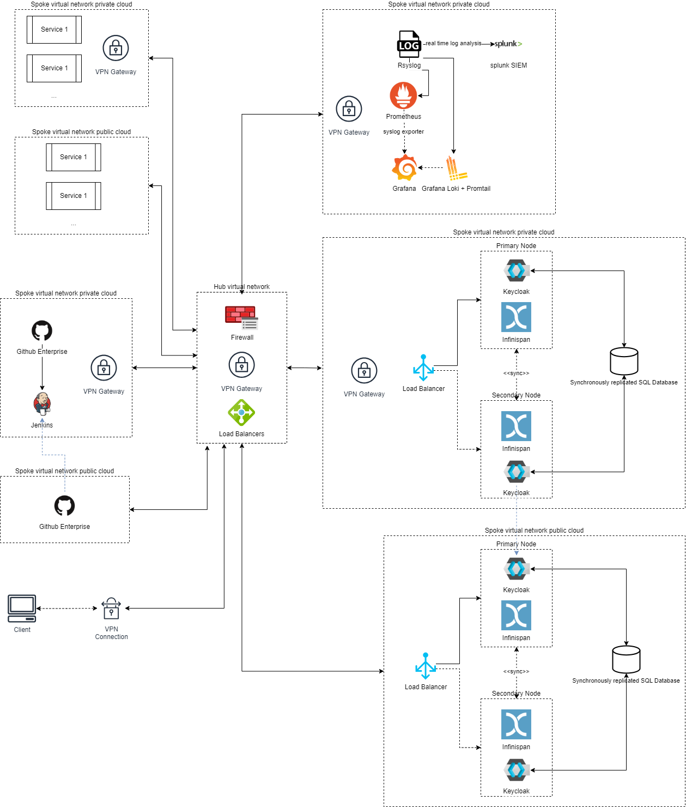

# WP02

## 1. Architecture Description

### Overview

The proposed architecture is designed to provide secure, reliable, and cloud-agnostic authentication mechanisms for GitHub Enterprise services across a hybrid cloud environment consisting of public cloud, e.g. Microsoft Azure, and a private cloud. The central component of this architecture is Keycloak, an open-source Identity and Access Management (IAM) solution provided by the central IT. The architecture ensures seamless integration, high availability, and compliance with security standards.

### Overview of Components we decided to Use

1. **Keycloak Identity Provider (IDP):** As given as a requirement to use Keycloak we propose a deployment in a high-availability configuration across both public and the private cloud to ensure redundancy and low-latency access for users in different environments.
2. **GitHub Enterprise Server:**
    - Deployed on a virtual machine (VM) in the public and cloud
    - The VM should fulfill following requirements ([source](https://docs.github.com/en/enterprise-server@3.10/admin/installing-your-enterprise-server/setting-up-a-github-enterprise-server-instance/installing-github-enterprise-server-on-azure))
        - 20 vCPUs
        - 160GB RAM
        - 200GB Root Storage
        - 1TB Attached Storage
    - Integration with Keycloak for authentication and authorization
    - The underlaying infrastructure is managed with terraform and is deployed using CI/CD pipelines.
3. **CI/CD Pipeline:** Integration of GitHub Enterprise into the CI/CD tools (e.g. Jenkins) across the hybrid environment.
4. **Rsyslog:** To ensure centralized and fast log processing, a cental Rsyslog server is used. Rsyslog receives log entries from applications and services so they can be monitored, analyzed and archived using the monitoring and logging tools described below.
5. **Grafana + Loki/Promtail + Prometheus** as Monitoring & Logging Tool
    - Prometheus collects **fine-grained metrics** from each service
    - Loki collects **metric data related to logs**
    - Grafana allows **flexible visualization and custom alerting**
    - **Easily** **scale** monitoring as new sources are added through Rsyslog or directly
6. **Splunk** as Security Information and Event Management (SIEM)
    - Integration for real-time security monitoring

### Authentication Mechanisms

### Identity Provider Options in a Hybrid Environment

- **Federated Keycloak Deployment:** Keycloak instances are deployed in both the public and the private cloud, configured in a cluster with bidirectional synchronization to ensure consistency.
- **High Availability Setup:** It is recommended to distribute auth traffic between different keycloak instances. Thus a load balancer should be used. All keycloak instances still access the same or a replicated data storages. This makes the setup more reliable, scalable and available.

#### Fallback Solutions for IDP Outage

- **Redundant Keycloak Instances:** Deployment of multiple Keycloak instances with load balancing to prevent single points of failure as described in the High Availability Setup section above.
- **Failover Mechanism:** Automated failover to a backup IDP instance in case the primary IDP fails.
- **Offline Access Tokens:** Configuring offline tokens with appropriate security controls to allow service continuity. ([source](https://wjw465150.gitbooks.io/keycloak-documentation/content/server_admin/topics/sessions/offline.html))

### Authentication Protocols

- **OpenID Connect (OIDC):** Selected for its modern approach, compatibility with OAuth 2.0, and support in Keycloak and GitHub Enterprise.
  - *Justification:* OIDC is lightweight, JSON-based, and widely adopted for modern web applications. It allows for better integration with RESTful services and mobile applications.
- **SAML 2.0:** Also supported to ensure compatibility with any legacy systems or services requiring SAML.
  - *Justification:* SAML is a mature protocol suitable for enterprise SSO scenarios, ensuring backward compatibility.

### GitHub Integration

### Integration with CI/CD Pipeline

- **Webhooks and API Integration:** GitHub Enterprise communicates with CI/CD tools via webhooks and APIs secured through Keycloak authentication. We assume that Jenkins is currently in use and included it into the overall architecture.
- **Infrastructure as Code (IaC):** Use of tools like Terraform and Ansible to manage infrastructure and configurations, with repositories hosted on GitHub Enterprise.

### Authentication and Authorization for Repositories

- **Role-Based Access Control (RBAC):** Defined roles and permissions within GitHub Enterprise managed via Keycloak groups and roles. ([source](https://www.keycloak.org/docs/latest/authorization_services/index.html))
- **Single Sign-On (SSO):** As for other applications, also for GitHub, Users authenticate once via Keycloak and gain access to all authorized repositories and services.
- **Github structure:** The Github Enterprise is split into Organizations, Teams, Projects and Repos, each having only the users and groups as members. Here again, the assignments of the roles and memberships follows the least privilege principle.
- **Fine-Grained Personal Access Tokens (PATs):** Tokens issued by Github Enterprise for Github access with scoped permissions to use where other authentication methods are not suitable.

### Peripheral Aspects

### Monitoring & Logging

- **Audit Logs:** Keycloak's audit logs capture authentication events, which are forwarded to the centralized logging system.
- **Monitoring Tools:** Prometheus and Grafana monitor system health, authentication metrics, and performance indicators.
- **Anomaly Detection:** Implementing anomaly detection to identify unusual access patterns or potential security threats in Splunk and trigger alerts.

### Splunk Integration

- **Log Forwarding:** All authentication and access logs are forwarded to the SIEM system in real-time.
- **Correlation Rules:** SIEM analyzes logs to correlate events, detect security incidents, and generate alerts.
- **Dashboard and Reporting:** Custom dashboards provide insights into authentication activities, compliance status, and security posture.

### Security Framework Compliance

### Security Standards & Frameworks

ISO/IEC 27001 is ideal for the location Germany due to its **GDPR** alignment, international recognition, and structured approach to managing security across people, processes, and technology. It is also recognized world wide and one of the most commonly needed and used standard for information systems. However the ISO is more a standard and a certification for processes than a framework.

Additionally, NIST CSF 2.0 complements ISO/IEC 27001 by providing a flexible framework that addresses emerging cyber threats and technologies. This combination ensures a comprehensive approach to cybersecurity that is both internationally recognized and adaptable to evolving risks. By implementing both frameworks, the organization can achieve a robust security posture that meets global standards while remaining agile in the face of new challenges.

### Ensuring Compliance

- **Policies and Procedures:** Implementing NIST security policies aligned with the ISO27001 controls.
- **Regular Assessments:** Conducting periodic security assessments and audits.
- **Training and Awareness:** Providing security training to users and administrators.
- **Data Protection Measures:** Encrypting data in transit and at rest, implementing strong access controls.
- **Secret and Keys Storage:** Secrets, passwords, keys and any sensible information are saved in encrypted KeyVaults. The access to the values are restricted to the as smallest group as possible (least privilege approach). All access to the values are logged and reported to Spunk.
- **Static Code Analysis:** Enforce enterprise wide static code analysis before publishing code by tools like Sonarqube in the pipeline

### Authentication Flows

There many ways to authenticate a user or service based on OpenID Connect (OIDC). OIDC is based on OAuth 2.0. 

Here we describe the common OIDC Auth Flows and the decision where to use which flow:

- AuthCode with PKCE
- Interaction Code
- AuthCode
- Client Credentials

## 2. Architecture Diagrams

### Diagram 1: High-Level Architecture

- **Users:** Accessing services from the internet and intranet.
- **Load Balancers:** Distribute traffic from the hub to the specific spokes.
- **Keycloak Cluster:** Instances in both public and private cloud, synchronized for high availability.
- **GitHub Enterprise Server:** Replicated in both public and private cloud and integrated with Keycloak via OIDC/SAML.
- **CI/CD Tools:** Connected to GitHub Enterprise, using Keycloak for authentication.
- **Monitoring, Logging and SIEM Systems:** Collecting logs from Keycloak and GitHub Enterprise

### Diagram 2: Authentication Flow

**[Description of Diagram]**

1. **User Request:** User attempts to access GitHub Enterprise.
2. **Redirect to Keycloak:** GitHub redirects the user to Keycloak for authentication.
3. **Authentication:** User authenticates with Keycloak (password, MFA).
4. **Token Issuance:** Keycloak issues an OIDC token.
5. **Access Granted:** User is redirected back to GitHub with the token, access is granted.
6. **Logging:** All events are logged and forwarded to the SIEM.

## 3. Reliability Analysis

### Potential Points of Failure

- **IDP Outage:** Failure of Keycloak could prevent user authentication.
- **Network Connectivity Issues:** Network problems could disrupt communication between components.
- **Service Overload:** High traffic might overwhelm servers.
- **Private Cloud Outage**: The private cloud can suffer an outage and all services depending on the private cloud would not be available. Especially for critical services such as Splunk it must be ensured that is always available or replicated in the public cloud.

### Mitigation Strategies

### Redundancy and High Availability

- **Keycloak Clustering:** Multiple Keycloak instances with session replication.
- **Geographical Distribution:** Deploy instances in different data centers to mitigate localized failures.
- **Load Balancing:** Use of load balancers to distribute traffic and detect failed instances.
- **Private Public Cloud Replication**:  We propose implementing a hybrid cloud strategy with failover capabilities. This approach involves replicating critical services and data across both the private cloud and Azure, ensuring continuity of operations even if one environment experiences an outage.

### Failover Mechanisms

- **Automated Failover:** Scripts or services that automatically switch to backup systems upon failure detection.
- **Health Checks:** Regular health monitoring of services to detect and respond to issues promptly.

### Disaster Recovery

- **Data Backups:** Regular backups of configurations and data.
- **Recovery Plans:** Documented procedures for restoring services.

### Capacity Planning

- **Scalability:** Design systems to scale horizontally to handle increased load.
- **Performance Monitoring:** Continuous monitoring to anticipate and address bottlenecks.

## 4. Justifications

### Authentication Mechanisms and Protocols

- **Keycloak as IDP:** Provides a unified, open-source solution compatible with required protocols.
- **OIDC Selection:** Besides above mentioned justification, it is modern, REST-friendly, and suitable for microservices architecture.
- **Fallback/Failover Solutions:** Ensuring no single point of failure enhances reliability and user trust.

### Monitoring and Security Framework

- **Monitoring Tools:** Prometheus and Grafana provide comprehensive visibility into system health and performance, enabling proactive issue detection and resolution. These tools offer real-time insights, customizable dashboards, and alerting capabilities, ensuring optimal system operation and rapid response to potential problems. Splunk integration provides advanced log management and analysis capabilities, enabling deeper insights into security events and user activities. Its powerful search and correlation features enhance threat detection and incident response, complementing the real-time monitoring provided by Prometheus and Grafana.
- **ISO/IEC 27001 + NIST CSF 2.0 Selection:** The ISO standards are internationally recognized and accepted. Thus, a certification does not only proofs the security of the systems, but also builds trust for partners and suppliers.  In addition NIST CSF 2.0 provides a robust framework adaptable to hybrid cloud environments and compatible with the ISO/IEC 27001 standards. it is developed by the US government and has the focus on cybersecurity. Besides that, it is customizable and flexible. In the US it is widely used in healthcare, finance and energy.

## Architecture decision records

Based on ([Decision record template by Michael Nygard](https://github.com/joelparkerhenderson/architecture-decision-record))

### Choosing rsyslog as the centralized logging system

#### Status

Accepted

#### Context

As part of our efforts to improve the reliability and efficiency of our logging infrastructure, we need a centralized logging system that can handle high volumes of log data, provide robust features for log management, and ensure compatibility with our tools and services.

#### Decision

We have decided to adopt rsyslog as our centralized logging system. This choice is based on its ability to handle high log volumes efficiently, its compatibility with various log formats and protocols, and its support for advanced features such as log rotation, filtering, and forwarding.

#### Consequences

Adopting rsyslog as our centralized logging system will streamline log management by aggregating logs from multiple sources into a single, manageable location. This consolidation will simplify the process of analyzing and troubleshooting issues, making it easier to detect and address problems more effectively. The scalability of rsyslog ensures it can handle high volumes of log data, adapting as our needs grow, and its integration with existing tools and systems will facilitate a smooth transition.

### Title

Choice of monitoring tools

#### Status

Accepted

#### Context

#### Decision

#### Consequences

What becomes easier or more difficult to do because of this change?

### Title

Choice SIEM solution

#### Status

Accepted

#### Context

What is the issue that we're seeing that is motivating this decision or change?

#### Decision

    - We decided to use Spunk over IBM QRadar because
        - Better ecosystem and integration due to a bigger community
        - Better risk based alerting (RBA) to address risks proactively
        - Better customer support ([source](https://www.splunk.com/en_us/form/idc-marketscape-siem.html))

#### Consequences

What becomes easier or more difficult to do because of this change?

### Title

Choice of primary authentication protocol

#### Status

Accepted

#### Context

What is the issue that we're seeing that is motivating this decision or change?

#### Decision

We decided to **use OIDC as the primary authentication protocol** because of the above mentioned justifications. However, due to the maturity of SAML and better backward compatibility, it is highly recommended to keep the SAML auth protocol as an secondary alternative.

#### Consequences

What becomes easier or more difficult to do because of this change?

### Title

Choice of security framework

#### Status

Accepted

#### Context

1. **ISO/IEC 27001**
    
    Widely used in Germany, ISO/IEC 27001 aligns with **GDPR** and offers a systematic approach to information security management, covering people, processes, and technology.
    
2. **BSI IT-Grundschutz**
    
    Developed by Germany’s **Federal Office for Information Security (BSI)**, IT-Grundschutz provides comprehensive guidelines for cybersecurity, emphasizing compliance with German regulations.
    
3. **CIS Controls**
    
    Though not a European standard, CIS Controls are popular in Germany for their practical, prioritized actions to mitigate common cyber threats.
    
4. **NIST CSF 2.0**
    
    The NIST Cybersecurity Framework (CSF) 2.0, while primarily developed for U.S. organizations, has gained international recognition for its comprehensive approach to cybersecurity risk management. It provides a flexible and adaptable framework that can complement ISO/IEC 27001 in addressing emerging cyber threats and technologies.
    

#### Decision

**Framework Selection:  ISO/IEC 27001 Compliance + NIST CSF2.0**

ISO/IEC 27001 is ideal for the location Germany due to its **GDPR** alignment, international recognition, and structured approach to managing security across people, processes, and technology. It is also recognized world wide and one of the most commonly needed and used standard for information systems. However the ISO is more a standard and a certification for processes than a framework.

Additionally, NIST CSF 2.0 complements ISO/IEC 27001 by providing a flexible framework that addresses emerging cyber threats and technologies. This combination ensures a comprehensive approach to cybersecurity that is both internationally recognized and adaptable to evolving risks. By implementing both frameworks, the organization can achieve a robust security posture that meets global standards while remaining agile in the face of new challenges.

#### Consequences

What becomes easier or more difficult to do because of this change?